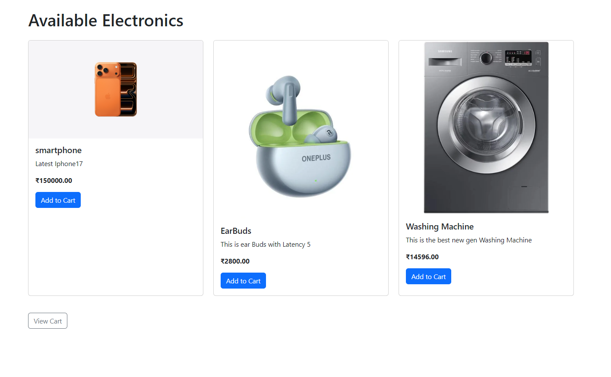

  
  
  
  
  

# Django Electronic Store

A Django-based electronic store web app with product listing, cart system, delivery form, and admin panel.

## Features
- Browse electronic products
- Add items to cart
- Fill delivery details
- Place an order
- Admin panel for managing products

## How to Run
1. Clone the repository  
2. Install dependencies  
3. Run migrations  
4. Start the development server  

## Tech Stack
- Django
- HTML/CSS
- SQLite

## Project Structure
django-electronic-store/ │ ├── onlinestore/               # Main project settings
│   ├── settings.py            # Django settings
│   ├── urls.py                # Project URL configuration
│   └── wsgi.py                # WSGI entry point
│ ├── store/                     # Core app for products & cart
│   ├── models.py              # Database models
│   ├── views.py               # View logic
│   ├── urls.py                # App URL routes
│   ├── templates/             # HTML templates
│   └── admin.py               # Admin panel configuration
│ ├── media/products/            # Uploaded product images
│ ├── manage.py                  # Django management script
├── requirements.txt           # Project dependencies
└── README.md                  # Project documentation

## Author
Harshal Raut

## Screenshots

### 🖥️ Product List Page

### 🛒 Cart Page

### 📦 Delivery Form

### ✅ Thank You Page

